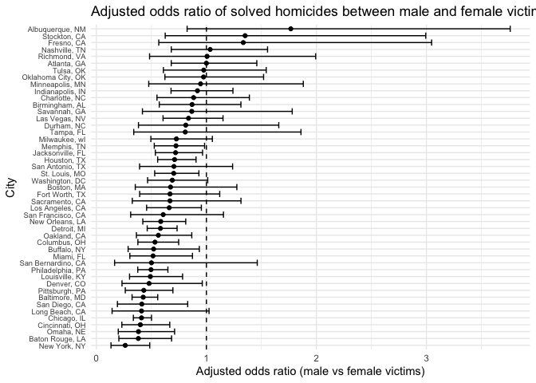
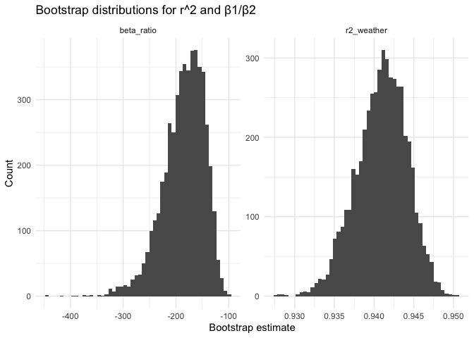
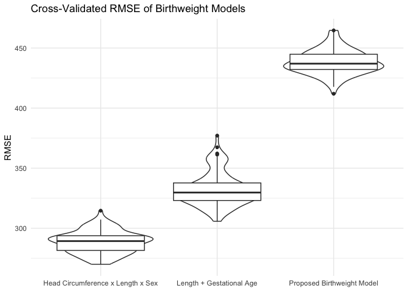

P8105 HW 6
================
Veerapetch Petchger
2025-12-01

# Problem 1

**The Washington Post has gathered data on homicides in 50 large U.S.
cities and made the data available through a GitHub repository here. You
can read their accompanying article here.**

**Create a city_state variable (e.g. “Baltimore, MD”), and a binary
variable indicating whether the homicide is solved. Omit cities Dallas,
TX; Phoenix, AZ; and Kansas City, MO – these don’t report victim race.
Also omit Tulsa, AL – this is a data entry mistake. For this problem,
limit your analysis those for whom victim_race is white or black. Be
sure that victim_age is numeric.**

``` r
homicide_df = read_csv("homicide-data.csv") %>% 
  janitor::clean_names() %>% 
  mutate(
    city_state = str_c(city, state, sep = ", "),
    solved = if_else(disposition == "Closed by arrest", 1, 0),
    victim_age = as.numeric(victim_age)
  ) %>%
  filter(!city_state %in% c("Dallas, TX", "Phoenix, AZ", "Kansas City, MO", "Tulsa, AL"),
         victim_race %in% c("White", "Black")) %>% 
  select(-city, -state)
```

**For the city of Baltimore, MD, use the glm function to fit a logistic
regression with resolved vs unresolved as the outcome and victim age,
sex and race as predictors. Save the output of glm as an R object; apply
the broom::tidy to this object; and obtain the estimate and confidence
interval of the adjusted odds ratio for solving homicides comparing male
victims to female victims keeping all other variables fixed.**

``` r
baltimore_glm =  
  homicide_df %>% 
  filter(city_state == "Baltimore, MD") %>%
  glm(
    solved ~ victim_age + victim_sex + victim_race,
    data = ., family = binomial()
  )

baltimore_glm  %>% 
  broom::tidy(conf.int = TRUE, exponentiate = TRUE) %>%
  filter(term == "victim_sexMale") %>%
  select(term, estimate, conf.low, conf.high)
```

    ## # A tibble: 1 × 4
    ##   term           estimate conf.low conf.high
    ##   <chr>             <dbl>    <dbl>     <dbl>
    ## 1 victim_sexMale    0.426    0.324     0.558

**Now run glm for each of the cities in your dataset, and extract the
adjusted odds ratio (and CI) for solving homicides comparing male
victims to female victims. Do this within a “tidy” pipeline, making use
of purrr::map, list columns, and unnest as necessary to create a
dataframe with estimated ORs and CIs for each city.**

``` r
city_glm =
  homicide_df %>% 
  group_by(city_state) %>% 
  nest() %>% 
  mutate(
    fit = map(data, ~ glm(solved ~ victim_age + victim_sex + victim_race,
                          data = ., family = binomial())),
    tidy_fit = map(.x = fit, ~broom::tidy(.x, conf.int = TRUE, exponentiate = TRUE) )
  ) %>% 
  select(city_state, tidy_fit) %>% 
  unnest(tidy_fit) %>% 
  filter(term == "victim_sexMale") %>%
  select(city_state, estimate, conf.low, conf.high)
city_glm
```

    ## # A tibble: 47 × 4
    ## # Groups:   city_state [47]
    ##    city_state      estimate conf.low conf.high
    ##    <chr>              <dbl>    <dbl>     <dbl>
    ##  1 Albuquerque, NM    1.77     0.825     3.76 
    ##  2 Atlanta, GA        1.00     0.680     1.46 
    ##  3 Baltimore, MD      0.426    0.324     0.558
    ##  4 Baton Rouge, LA    0.381    0.204     0.684
    ##  5 Birmingham, AL     0.870    0.571     1.31 
    ##  6 Boston, MA         0.674    0.353     1.28 
    ##  7 Buffalo, NY        0.521    0.288     0.936
    ##  8 Charlotte, NC      0.884    0.551     1.39 
    ##  9 Chicago, IL        0.410    0.336     0.501
    ## 10 Cincinnati, OH     0.400    0.231     0.667
    ## # ℹ 37 more rows

**Create a plot that shows the estimated ORs and CIs for each city.
Organize cities according to estimated OR, and comment on the plot.**

``` r
city_glm %>% 
  ggplot(aes(x = reorder(city_state, estimate), y = estimate)) +
  geom_point() +
  geom_errorbar(aes(ymin = conf.low, ymax = conf.high)) +
  geom_hline(yintercept = 1, linetype = "dashed") +
  coord_flip() +
  theme_minimal() +
  theme(axis.text.y = element_text(size = 7)) +
  labs(
    title = "Adjusted odds ratio of solved homicides between male and female victims",
    x = "City",
    y = "Adjusted odds ratio (male vs female victims)"
  )
```

<!-- --> The
majority of odds ratios are less than one, suggesting that cases female
homicide victims in these cities are less often resolved. Of these
cities, the odds ratio is statistically significant, implying sufficient
evidence of a true difference in case disposition across sexes. Three
cities report an odds ratio above 1, but they are not statistically
significant since the lower bound of the interval is below 1.

# Problem 2

**For this problem, we’ll use the Central Park weather data we’ve seen
elsewhere. The code chunk below will import these data from the
p8105.datasets package.**

**The bootstrap is helpful when you’d like to perform inference for a
parameter / value / summary that doesn’t have an easy-to-write-down
distribution in the usual repeated sampling framework. We’ll focus on a
simple linear regression with tmax as the response with tmin and prcp as
the predictors, and are interested in the distribution of two quantities
estimated from these data:**

- 𝑟̂ 2

- 𝛽̂ 1𝛽̂ 2

**Use 5000 bootstrap samples and, for each bootstrap sample, produce
estimates of these two quantities. Plot the distribution of your
estimates, and describe these in words. Using the 5000 bootstrap
estimates, identify the 2.5% and 97.5% quantiles to provide a 95%
confidence interval for 𝑟̂ 2 and 𝛽̂ 1𝛽̂ 2.**

**Note: broom::glance() is helpful for extracting 𝑟̂ 2 from a fitted
regression, and broom::tidy() (with some additional wrangling) should
help in computing 𝛽̂ 1𝛽̂ 2.**

``` r
set.seed(123)
weather_boot = 
  weather_df %>% 
  drop_na(tmax, tmin, prcp) %>%
  bootstrap(n = 5000, id = "strap_id") %>% 
  mutate(
    fit = map(strap, ~lm(tmax ~ tmin + prcp, data = .x)),
    glance = map(fit, broom::glance),
    tidy = map(fit, broom::tidy)
  ) %>% 
  mutate(
    r2_weather = map_dbl(glance, "r.squared"),
    beta_ratio = map_dbl(tidy, ~ {
      b1 = .x %>% 
        filter(term == "tmin") %>% pull(estimate)
      b2 = .x %>% 
        filter(term == "prcp") %>% pull(estimate)
      b1 / b2
    })
  ) %>% 
  select(strap_id, r2_weather, beta_ratio)

weather_long =
  weather_boot %>% 
  pivot_longer(
    cols = c("r2_weather", "beta_ratio"),
    names_to = "parameter",
    values_to = "estimate"
  )

weather_long %>% 
  ggplot(aes(x = estimate)) + 
  geom_histogram(bins = 50) +
  facet_wrap(. ~ parameter, scales = "free") +
  labs(
    title = "Bootstrap distributions for r^2 and β1/β2",
    x = "Bootstrap estimate",
    y = "Count"
  ) +
  theme_minimal()
```

<!-- -->

``` r
weather_long %>% 
  group_by(parameter) %>% 
  summarize(
    ci_lower = quantile(estimate, 0.275),
    ci_upper = quantile(estimate, 0.975)
  )
```

    ## # A tibble: 2 × 3
    ##   parameter  ci_lower ci_upper
    ##   <chr>         <dbl>    <dbl>
    ## 1 beta_ratio -205.    -126.   
    ## 2 r2_weather    0.939    0.947

# Problem 3

**Load and clean the data for regression analysis (i.e. use appropriate
variable names, convert numeric to factor where appropriate, check for
the presence of missing data, etc.).**

``` r
birthweight_df = 
  read_csv("birthweight.csv") %>% 
  janitor::clean_names() %>% 
  mutate(
    babysex = factor(babysex,
                     levels = c(1,2),
                     labels = c("male", "female")),
    frace = factor(frace,
                   levels = c(1, 2, 3, 4, 8, 9),
                   labels = c("White", "Black", "Asian", "Puerto Rican", "Other", "Unknown" )),
    malform = factor(malform,
                     levels = c(0,1),
                     labels = c("absent", "present")),
    mrace = factor(mrace,
                   levels = c(1, 2, 3, 4, 8, 9),
                   labels = c("White", "Black", "Asian", "Puerto Rican", "Other", "Unknown" ))
  )
```

**Propose a regression model for birthweight. This model may be based on
a hypothesized structure for the factors that underly birthweight, on a
data-driven model-building process, or a combination of the two.
Describe your modeling process and show a plot of model residuals
against fitted values – use add_predictions and add_residuals in making
this plot.**

``` r
bwt_mod = 
  birthweight_df %>% 
  lm(bwt ~ babysex + gaweeks + malform + mheight + momage + mrace + parity + pnumlbw + pnumsga + smoken, data = .)
bwt_mod %>% 
  summary()
```

    ## 
    ## Call:
    ## lm(formula = bwt ~ babysex + gaweeks + malform + mheight + momage + 
    ##     mrace + parity + pnumlbw + pnumsga + smoken, data = .)
    ## 
    ## Residuals:
    ##      Min       1Q   Median       3Q      Max 
    ## -1671.16  -268.42     0.68   277.22  1476.35 
    ## 
    ## Coefficients: (2 not defined because of singularities)
    ##                    Estimate Std. Error t value Pr(>|t|)    
    ## (Intercept)       -965.5421   183.3988  -5.265 1.47e-07 ***
    ## babysexfemale      -97.2294    13.2677  -7.328 2.77e-13 ***
    ## gaweeks             59.3624     2.1471  27.648  < 2e-16 ***
    ## malformpresent      18.2040   112.8383   0.161  0.87184    
    ## mheight             30.9979     2.5797  12.016  < 2e-16 ***
    ## momage              -0.3904     1.8479  -0.211  0.83267    
    ## mraceBlack        -272.1654    15.2323 -17.868  < 2e-16 ***
    ## mraceAsian        -142.3882    67.8018  -2.100  0.03578 *  
    ## mracePuerto Rican -100.2695    30.6469  -3.272  0.00108 ** 
    ## parity             134.9742    64.6405   2.088  0.03685 *  
    ## pnumlbw                  NA         NA      NA       NA    
    ## pnumsga                  NA         NA      NA       NA    
    ## smoken             -11.3661     0.9249 -12.289  < 2e-16 ***
    ## ---
    ## Signif. codes:  0 '***' 0.001 '**' 0.01 '*' 0.05 '.' 0.1 ' ' 1
    ## 
    ## Residual standard error: 435.8 on 4331 degrees of freedom
    ## Multiple R-squared:  0.2777, Adjusted R-squared:  0.2761 
    ## F-statistic: 166.5 on 10 and 4331 DF,  p-value: < 2.2e-16

``` r
birthweight_df %>% 
  add_predictions(bwt_mod) %>% 
  add_residuals(bwt_mod) %>% 
  ggplot(aes(x = pred, y = resid)) +
  geom_point(alpha = 0.2) +
  geom_hline(yintercept = 0, linetype = "dashed") +
  labs(
    title = "Fitted values vs Residuals of Proposed Birthweight Model",
    x = "Fitted values",
    y = "Residuals"
  ) +
  theme_minimal()
```

<!-- -->
I created a multiple linear regression model with respect to birthweight
(`bwt`). The model investigates the relationships between several
variables that I felt are influential to determining `bwt`. These
variables are the baby’s sex (`babysex`), gestational age in weeks
(`gaweeks`), the presence of malformations (`malform`), the mother’s
race (`mrace`), number of prior live births (`parity`), number of prior
low birth weight babies (`pnumlbw`), number of prior small for
gestational age babies (`pnumsga`), and the average number of cigarettes
smoked per day (`smoken`). Measurements related to the babies’
phenotypes such as their head circumference (`bhead`) and length
(`blength`) at birth were excluded as they are competing outcomes with
`bwt`.

**Compare your model to two others:**

- One using length at birth and gestational age as predictors (main
  effects only)

``` r
bwt_model1 = 
  birthweight_df %>% 
  lm(bwt ~ blength + gaweeks, data = .)
```

- One using head circumference, length, sex, and all interactions
  (including the three-way interaction) between these

``` r
bwt_model2 = 
  birthweight_df %>% 
  lm(bwt ~ bhead * blength * babysex, data = .)
```

**Make this comparison in terms of the cross-validated prediction error;
use crossv_mc and functions in purrr as appropriate.**

``` r
set.seed(1)
cv_df = crossv_mc(birthweight_df, n = 100)

cv_results = 
  cv_df %>% 
  mutate(
    bwt_mod = map(train, 
                  ~ lm(bwt ~ babysex + gaweeks + malform + mheight + momage + mrace + parity + pnumlbw + pnumsga + smoken, data = .)),
    bwt_model1 = map(train, 
                     ~ lm(bwt ~ blength + gaweeks, data = .)),
    bwt_model2 = map(train, 
                     ~ lm(bwt ~ bhead * blength * babysex, data = .)),
    rmse_bwt_mod = map2_dbl(bwt_mod, test, ~ rmse(.x, .y)),
    rmse_model1 = map2_dbl(bwt_model1, test, ~ rmse(.x, .y)),
    rmse_model2 = map2_dbl(bwt_model2, test, ~ rmse(.x, .y))
  )

cv_long =
  cv_results %>% 
  select(starts_with("rmse_")) %>% 
  pivot_longer(
    cols = everything(),
    names_to = "model",
    values_to = "rmse"
  ) %>% 
  mutate(
    model = recode(model,
                   rmse_bwt_mod = "Proposed Birthweight Model",
                   rmse_model1 = "Length + Gestational Age",
                   rmse_model2 = "Head Circumference x Length x Sex")
  )

cv_long %>% 
  ggplot(aes(x = model, y = rmse)) +
  geom_violin() +
  geom_boxplot() +
  labs(
    title = "Cross-Validated RMSE of Birthweight Models",
    x = NULL,
    y = "RMSE"
  ) +
  theme_minimal()
```

<!-- -->

``` r
cv_long %>% 
  group_by(model) %>% 
  summarize(
    avg_rmse = mean(rmse),
    sd_rmse = sd(rmse)
  )
```

    ## # A tibble: 3 × 3
    ##   model                             avg_rmse sd_rmse
    ##   <chr>                                <dbl>   <dbl>
    ## 1 Head Circumference x Length x Sex     289.    9.22
    ## 2 Length + Gestational Age              332.   14.0 
    ## 3 Proposed Birthweight Model            438.   10.0

**Note that although we expect your model to be reasonable, model
building itself is not a main idea of the course and we don’t
necessarily expect your model to be “optimal”.**

I computed the test-set RMSE for all 3 models through 100 train-test
splits. Based on the boxplot-violin plot diagram, the second comparison
model (Head Circumference x Length x Sex) yielded the lowest RMSE,
followed by the first comparison model (Length + Gestational Age), and
lastly my proposed model, due to the number of predictors. This results
in a difference in RMSE of ~ 150 g to the second comparison model, and ~
100 g to the first comparison model. The second comparison model appears
highly predictive because the predictors are direct measurements of
infants at birth, and thus contribute to the birthweight. My proposed
model focuses on the relationship between prenatal factors and the
birthweight, resulting in a less accurate prediction of the birthweight.
